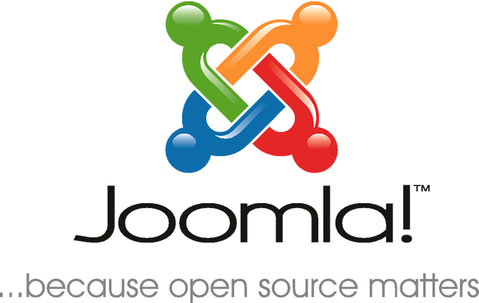

### Joomla

cAPI is compatible with the latest stable version of Joomla 3.4.x or higher. We recommend [Joomla 3.6.5](https://www.joomla.org/announcements/release-news/5693-joomla-3-6-5-released.html) (latest version).

### Additional Requirements

Included below is an example of a popular and support server configuration. We build our developement environments using the REMI and EPEL repos (REMI mainly for PHP 5.6.x / 7.1.x and MySQL 5.5.x). 

#### Linux

RHEL / CentOS 6.x, 7.x (latest, stable)

#### Apache

Apache 2.2.x,2.4.x (latest, stable/patched)

#### PHP

Minimum: PHP 5.5.x (latest, stable)

#### MySQL

Minium: MySQL 5.5.x (latest, stable)

