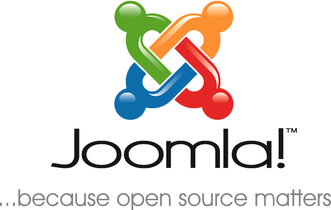

### Joomla

cAPI is compatible with the latest stable version of Joomla 3.9.x or higher. We recommend [Joomla 3.9.12](https://www.joomla.org/announcements/release-news/5776-joomla-3-9-12.html) (latest version). [More info...](https://www.joomla.org/3/).

### Additional Requirements

Included below is an example of popular / supported server configurations. We build our developement environments using the REMI and EPEL repos (REMI mainly for PHP 5.6.x / 7.2.x+ and MariaDB 5.5.x+). 

#### Linux

RHEL 7 / CentOS 7.x (latest, stable)
Fedora (working, limited testing)
Ubuntu (working, limited testing)

#### Apache

Apache 2.2.x,2.4.x (latest, stable/patched)
Nginx not officially supported yet
* Documentation will be updated to include recommendations for required Nginx configuration

#### PHP

Minimum: PHP 7.0.x (latest, stable)
Recommended: PHP 7.1.x (latest, stable) Note that this will depend on compatiblity of other Joomla extensions with PHP7.

cAPI v2
Minimum: PHP 7.2.x (latest, stable)

#### MySQL

Minium: MySQL 5.5.x (latest, stable)
Recommended: MariaDB (latest, stable)

