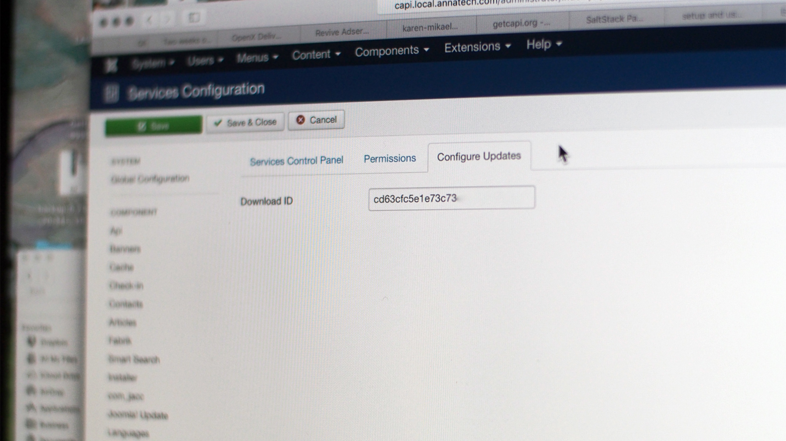

Once you have downloaded and installed the cAPI Core Package make sure to log into your account to get your download ID.

[My Account](https://www.annatech.com/index.php?option=com_payplans&view=dashboard&task=frontview&Itemid=1014)

1. Copy your download ID and log into your website.
2. Go to Components > cAPI Core REST API and click on "Options" (top right).
3. Next, click on the "Download ID" tab where you can paste your ID.

_Above image may not accurately reflect current version._

With an active subscription this will allow you to download and install future updates directly from your website!