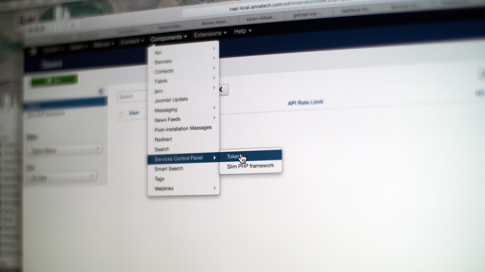

Creating new API tokens is easy!

1. Log into the Joomla administrative back-end.
2. Go to Components > Services Control Panel and click on "Tokens".
3. Click "New".
4. Click on the "Select a user" field to choose the Joomla user to which the token will be assigned.
5. Click "Save" and you're done!

This completes the minium configuration necessary for setting up token-based authentication. Please ensure that the associated Joomla user has correct permissions matching the intended use of this token.

>>>>>> Mulitple tokens can be created for any Joomla user!
>>>>>> 
>>>>>> You can extend Joomla authentication to include external user directories like Microsoft Active Directory. [Shawn Maunder](http://shmanic.com) has developed an excellent set of extensions for joining Joomla authentication to AD via LDAP. I highly recommend checking out his software and supporting his development: [http://shmanic.com/tools/jmapmyldap/download.htm](http://shmanic.com/tools/jmapmyldap/download.htm)